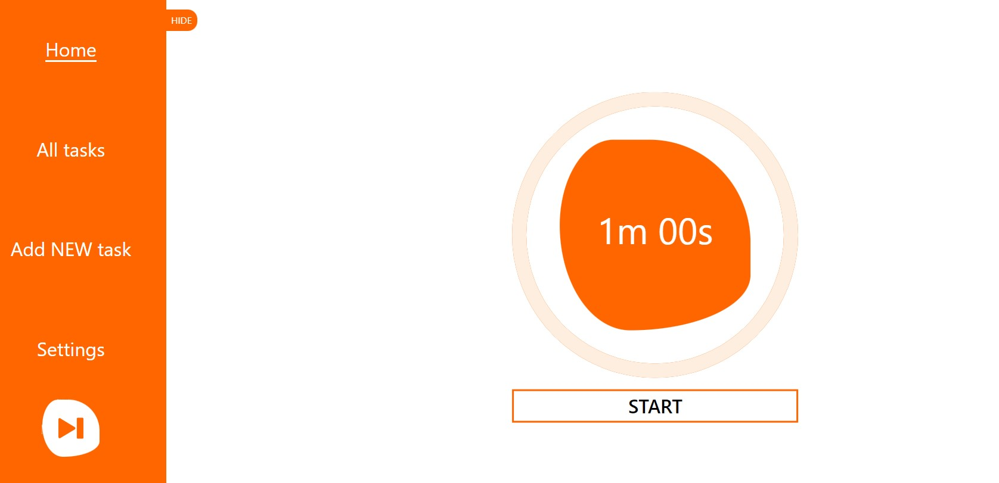

# Pomodoro 2.0

This project is an application for using the "Pomodoro" technique, which helps to better manage time and increase productivity. The "Pomodoro" technique is based on dividing working time into intervals with concentrated work (usually 25 minutes) and short breaks.

## Main functions:

1. Timer: The app has the ability to set a timer for a specific time (for example, 25 minutes) that counts down. After the time expires, the user receives a signal indicating a break.
2. Breaks: The application also allows you to set a timer for short breaks between tasks. Usually such breaks last 5 minutes and are intended for rest.
3. Customization: The user can set the duration of the task and the break according to his needs.
4. Soundtrack: the application has a built-in player for playing background music
